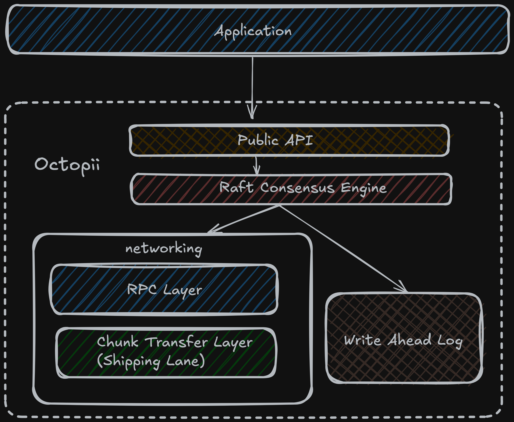

<div align="center">
  
  <div>Octopii: A distributed systems kernel for building replicated, fault-tolerant services</div>
  <br>

[](https://github.com/octopii-rs/octopii/actions)
[](LICENSE)

</div>

---

## Overview

Octopii is a distributed systems kernel that provides the fundamental primitives for building replicated, crash-resistant services. Unlike typical frameworks that glue libraries together, Octopii abstracts over time, storage, network, and randomness to enable both production deployment and rigorous deterministic testing.

### Core Components

- **Raft Consensus** - Two implementations: OpenRaft (async, production) and raft-rs (simulation mode)
- **Walrus WAL** - Custom Write-Ahead Log with two-phase commit, dual-topic durability, and crash recovery
- **QUIC Transport** - Encrypted, multiplexed networking with connection pooling via Quinn
- **Deterministic Simulation** - Controlled time, I/O fault injection, and reproducible randomness for crash testing
- **Durability Verification** - Multi-cycle crash recovery validation with invariant checking

## Architecture

<div>
  
</div>

## Features

| Feature | Description |
|---------|-------------|
| `openraft` (default) | Production mode with async Raft and QUIC transport |
| `simulation` | DST mode with fault injection and controlled time |
| `openraft-filters` | Network partition and delay simulation |

```toml
[dependencies]
octopii = { git = "https://github.com/octopii-rs/octopii", features = ["openraft"] }
```

## Quick Start

```rust
use octopii::{Config, OctopiiNode, OctopiiRuntime};

#[tokio::main]
async fn main() -> Result<(), Box<dyn std::error::Error>> {
    let runtime = OctopiiRuntime::new(4);

    let config = Config {
        node_id: 1,
        bind_addr: "127.0.0.1:5001".parse()?,
        peers: vec!["127.0.0.1:5002".parse()?],
        wal_dir: "./data/node1".into(),
        is_initial_leader: true,
        ..Default::default()
    };

    let node = OctopiiNode::new(config, runtime).await?;
    node.start().await?;

    // Write with consensus
    node.propose(b"SET key value".to_vec()).await?;

    // Read from state machine
    let value = node.query(b"GET key").await?;
    println!("Value: {:?}", String::from_utf8(value.to_vec()));

    Ok(())
}
```

## Custom State Machines

Implement `StateMachineTrait` to replicate your own logic:

```rust
impl StateMachineTrait for MyStateMachine {
    fn apply(&self, command: &[u8]) -> Result<Bytes, String> { /* deterministic execution */ }
    fn snapshot(&self) -> Vec<u8> { /* serialize state */ }
    fn restore(&self, data: &[u8]) -> Result<(), String> { /* restore from snapshot */ }
    fn compact(&self) -> Result<(), String> { Ok(()) } // optional
}
```

## Durability Model

Two-phase commit with dual topics for crash resistance:

1. Write to main topic → 2. Write to recovery topic → 3. Write commit marker

On recovery, only entries with a commit marker are visible. Prevents partial write corruption even with mid-operation crashes.

## Documentation

- [API.md](docs/API.md) - API reference
- [ARCHITECTURE.md](docs/ARCHITECTURE.md) - System internals
- [CUSTOM_STATE_MACHINES.md](docs/CUSTOM_STATE_MACHINES.md) - State machine guide
- [SHIPPING_LANE.md](docs/SHIPPING_LANE.md) - P2P file transfers

## Examples

`node/`, `custom_state_machine/`, `shipping_lane/`, `rpc/`, `rpc_shipping_lane/`, `wal/`, `runtime/`

```bash
cargo run --example node --features openraft
```

## Deterministic Simulation Testing (DST)

Octopii implements DST, the methodology pioneered by FoundationDB and adopted by TigerBeetle. Find bugs that would take years to surface in production by running millions of fault-injected operations in minutes.

### Abstraction Layer

| Component | Production | Simulation |
|-----------|------------|------------|
| Time | `tokio::time::Instant` | `SimInstant` (controlled) |
| Randomness | System RNG | `SimRng` (seeded XORshift) |
| File I/O | Real filesystem | `VFS` with fault injection |
| Network | QUIC/TCP | In-memory with partitions |

Given a seed, tests are fully reproducible.

### Fault Injection

I/O errors, partial writes (torn pages), fsync failures, artificial latency.

### Verification

Consistency, durability (`DurabilityOracle`), Raft invariants, recovery idempotence.

## Test Coverage

11,000+ lines of tests across 19 test files. The cluster simulation suite covers:

| Category | Coverage |
|----------|----------|
| Basic correctness | 3, 5, 7-node clusters |
| I/O faults | 5%, 10%, 15%, 20%, 25% error rates |
| Network faults | Partitions, leader isolation, flapping connectivity |
| Combined faults | I/O errors + network partitions |
| Crash recovery | Single node, leader, multi-cycle (3, 5, 8, 10 cycles) |
| Stress | Majority crash, full chaos mode |

Each category runs across 50 seeds by default, 1000 operations per run (5000 for stress).

```bash
cargo test --features openraft                           # Standard tests
cargo test --features simulation                         # DST with fault injection
CLUSTER_SEED_COUNT=200 cargo test --features simulation  # Extended coverage
```

## Project Status

Under active development. The DST infrastructure has validated crash recovery across hundreds of thousands of fault-injected operations.

## License

Licensed under the Apache License, Version 2.0. See [LICENSE](LICENSE) for details.
