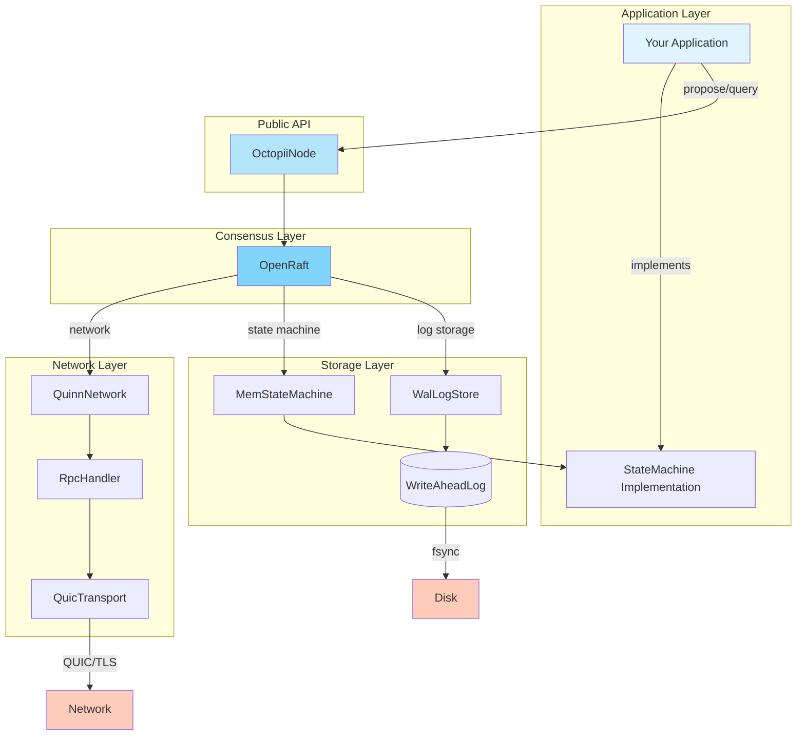
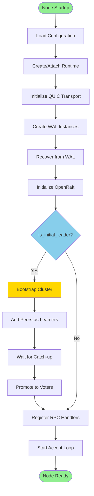
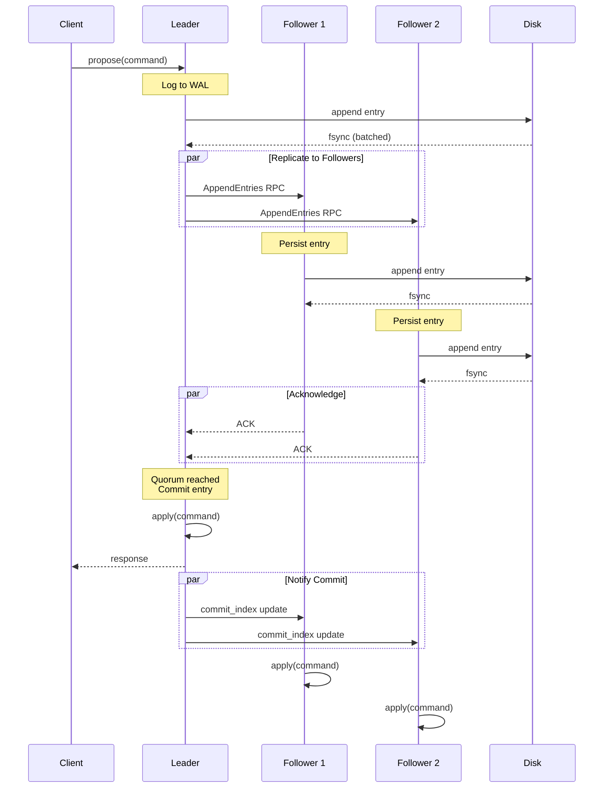
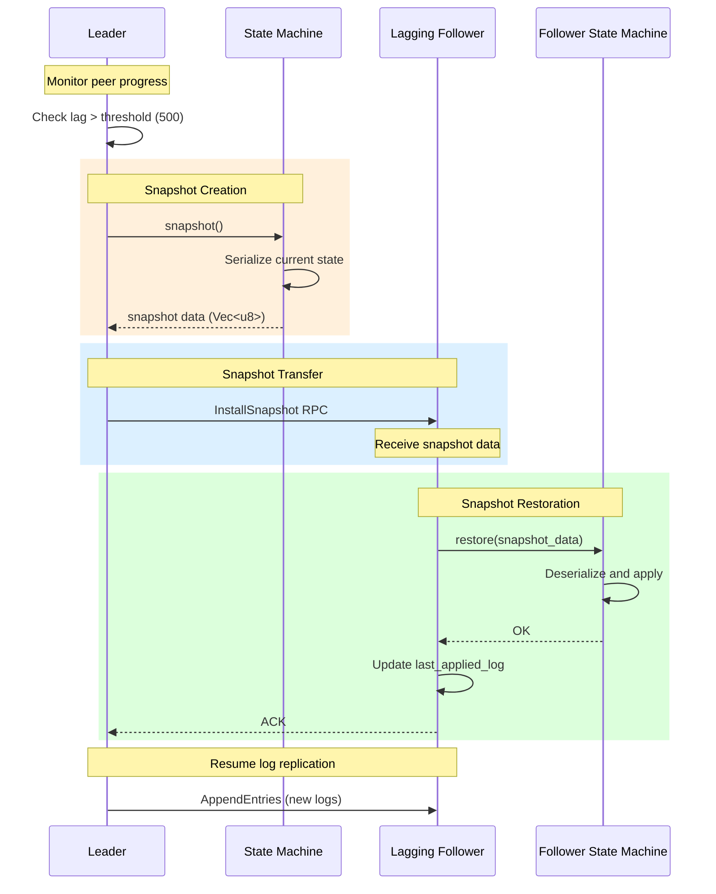
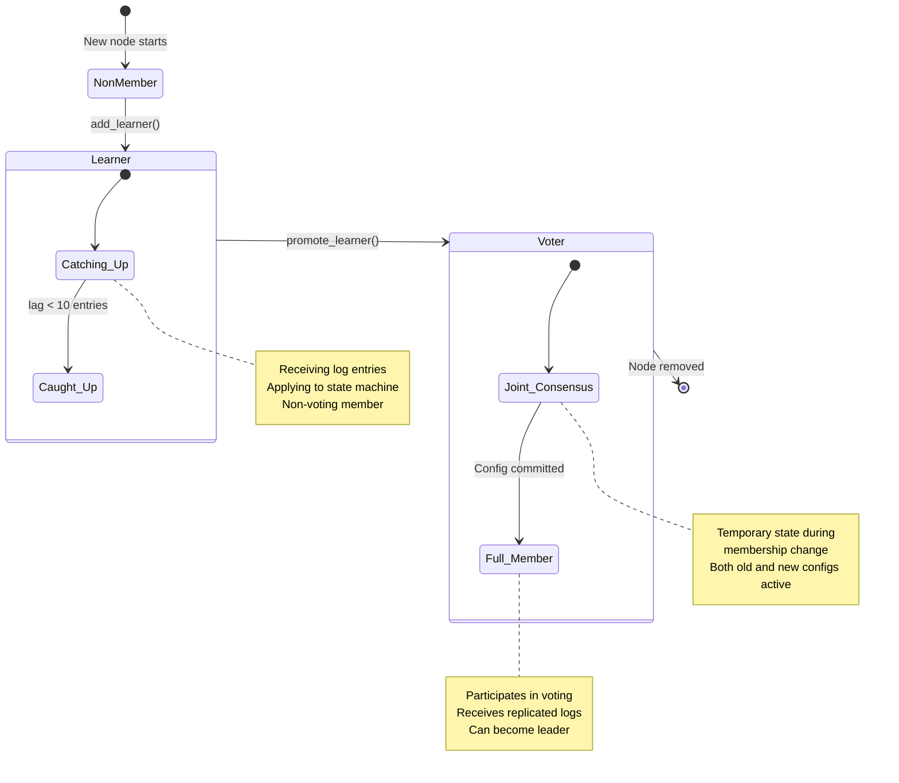
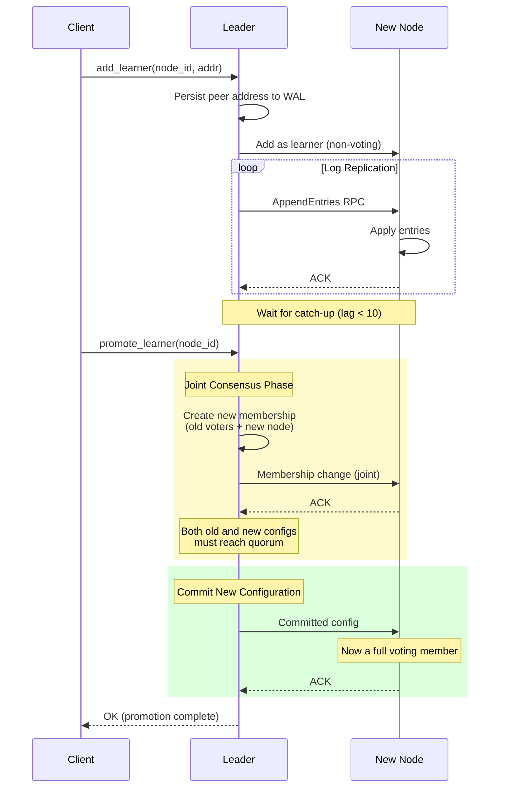
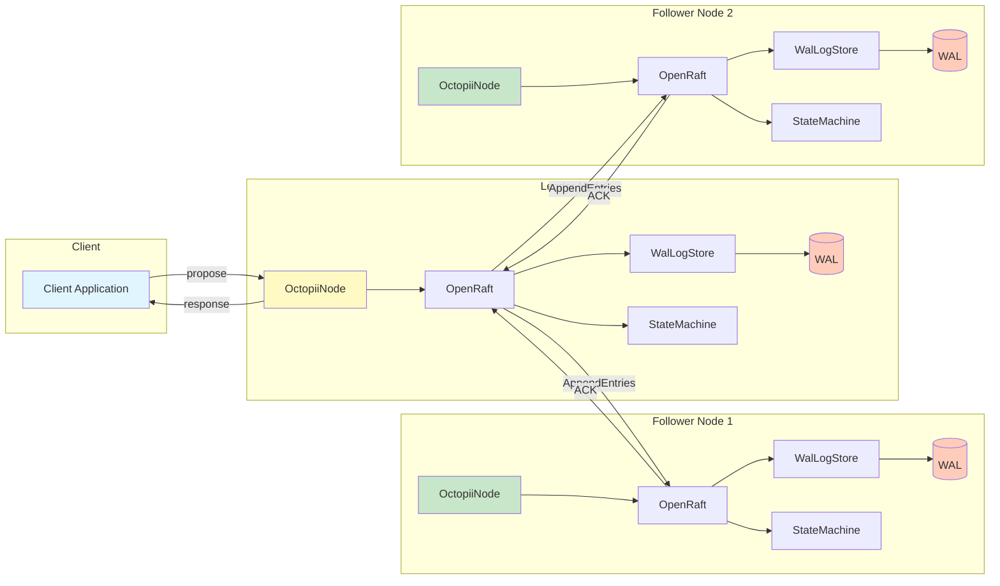

# Octopii Architecture

Octopii is a distributed consensus system built on top of OpenRaft, providing a modular and production-ready foundation for building replicated state machines in Rust.

## Table of Contents

1. [Overview](#overview)
2. [Core Components](#core-components)
3. [System Architecture](#system-architecture)
4. [Data Flow](#data-flow)
5. [Key Abstractions](#key-abstractions)
6. [Design Decisions](#design-decisions)
7. [Module Reference](#module-reference)

---

## Overview

Octopii provides a complete stack for distributed consensus:

```
┌─────────────────────────────────────────────────────┐
│                 Application Layer                    │
│           (Your State Machine Implementation)        │
└──────────────────────┬──────────────────────────────┘
                       │ StateMachineTrait
┌──────────────────────┴──────────────────────────────┐
│              OctopiiNode (Public API)                │
│  propose() │ query() │ add_learner() │ metrics()    │
└──────────────────────┬──────────────────────────────┘
                       │
┌──────────────────────┴──────────────────────────────┐
│              OpenRaft (Consensus Layer)              │
│   Leader Election │ Log Replication │ Snapshots     │
└─────┬───────────────────────────────────────┬───────┘
      │                                       │
┌─────┴──────────┐                   ┌────────┴──────┐
│  Storage Layer │                   │ Network Layer │
│                │                   │               │
│ ┌────────────┐ │                   │ ┌───────────┐ │
│ │ WalLogStore│ │                   │ │QuinnNetwork││
│ └─────┬──────┘ │                   │ └─────┬─────┘ │
│       │        │                   │       │       │
│ ┌─────┴──────┐ │                   │ ┌─────┴─────┐ │
│ │WriteAheadLog│ │                   │ │RpcHandler │ │
│ │  (Walrus)  │ │                   │ └─────┬─────┘ │
│ └────────────┘ │                   │       │       │
│                │                   │ ┌─────┴─────┐ │
│ ┌────────────┐ │                   │ │QuicTransport││
│ │MemStateMach│ │                   │ │  (Quinn)  │ │
│ │   ine      │ │                   │ └───────────┘ │
│ └────────────┘ │                   │               │
└────────────────┘                   └───────────────┘
         │                                    │
         │ Persistence                        │ Network
         ▼                                    ▼
    [Disk: WAL]                      [QUIC/TLS Streams]
```

**Key Features:**
- **Modular Design**: Clean separation of concerns across layers
- **QUIC Transport**: Low-latency, multiplexed, connection-oriented
- **Durable WAL**: Crash-resistant Write-Ahead Log with checksums
- **Pluggable State Machines**: Implement your logic via simple trait
- **Production Ready**: Connection pooling, batching, configurable flushing

### Component Relationship Diagram



---

## Core Components

### 1. OctopiiNode (src/openraft/node.rs)

The main entry point for all distributed operations.

```rust
// Initialization
let config = Config {
    node_id: 1,
    bind_addr: "127.0.0.1:5001",
    peers: vec![("127.0.0.1:5002", 2), ("127.0.0.1:5003", 3)],
    wal_dir: "/tmp/node1",
    ..Default::default()
};

let node = OctopiiNode::new(config, runtime, state_machine)?;
node.start().await?;

// Write operations (consensus required)
let response = node.propose(b"SET key value").await?;

// Read operations (local, no consensus)
let value = node.query(b"GET key").await?;

// Membership changes
node.add_learner(4, "127.0.0.1:5004").await?;
node.promote_learner(4).await?;
```

**Responsibilities:**
- Cluster membership management
- Proposal submission and query handling
- Snapshot triggering and peer progress tracking
- Peer address persistence and discovery

---

### 2. Transport Layer (src/transport/)

QUIC-based transport with automatic connection pooling.

```
    Node A                          Node B
       │                               │
       │  QuicTransport::connect()     │
       ├──────────────────────────────►│
       │   TLS Handshake (self-signed) │
       │◄──────────────────────────────┤
       │                               │
       │  PeerConnection established   │
       │  (stored in pool)             │
       │                               │
       │  send(data) ───────────────►  │
       │             ◄─────────────── recv()
       │                               │
       │  send_chunked(file) ────►     │
       │    [8 bytes: size]            │
       │    [N bytes: data]            │
       │    [32 bytes: SHA-256]        │
       │             ◄──── ACK (0=OK)  │
       │                               │
```

**Components:**

**QuicTransport** (src/transport/mod.rs)
```rust
pub struct QuicTransport {
    endpoint: Arc<Endpoint>,           // Quinn QUIC endpoint
    connections: Arc<Mutex<HashMap<SocketAddr, PeerConnection>>>,
}

impl QuicTransport {
    // Get or create connection to peer
    pub async fn connect(&self, addr: SocketAddr) -> Result<PeerConnection>

    // Accept incoming connections
    pub async fn accept(&self) -> Result<PeerConnection>
}
```

**PeerConnection** (src/transport/peer.rs)
```rust
// Simple send/recv
pub async fn send(&self, data: &[u8]) -> Result<()>
pub async fn recv(&self) -> Result<Bytes>

// Chunked transfer with checksums
pub async fn send_chunked(&self, source: ChunkSource) -> Result<()>
pub async fn recv_chunked(&self, dest: ChunkDest) -> Result<()>

// File streaming
pub async fn stream_to_file(&self, path: &Path) -> Result<()>
```

**TLS Configuration** (src/transport/tls.rs)
- Self-signed certificates (rcgen)
- Skips server verification (development mode)
- ALPN protocol: `"octopii"`
- 1024 concurrent bidirectional streams

---

### 3. RPC Framework (src/rpc/)

Request/response correlation layer on top of QUIC transport.

```
Client                RpcHandler              Server
  │                       │                      │
  │  request(msg_id=1)    │                      │
  ├──────────────────────►│                      │
  │  (oneshot channel)    │   serialize          │
  │                       ├─────────────────────►│
  │                       │                      │
  │                       │   deserialize        │
  │                       │◄─────────────────────┤
  │  response             │                      │
  │◄──────────────────────┤                      │
  │                       │                      │
```

**Message Types:**

```rust
enum RpcMessage {
    Request { id: u64, payload: RequestPayload },
    Response { id: u64, payload: ResponsePayload },
    OneWay(OneWayMessage),
}

enum RequestPayload {
    RaftMessage(raft_rs::RaftMessage),    // raft-rs backend
    OpenRaft(Vec<u8>),                     // openraft backend
    Custom(Bytes),                         // user-defined
}

enum ResponsePayload {
    AppendEntries(AppendEntriesResponse),
    RequestVote(RequestVoteResponse),
    Snapshot(SnapshotResponse),
    OpenRaft(Vec<u8>),
    CustomResponse(Bytes),
    Error(String),
}
```

**Handler Pattern:**

```rust
// Pseudocode for request handling
async fn handle_request(msg: RpcMessage, transport: QuicTransport) {
    match msg {
        RpcMessage::Request { id, payload } => {
            let response = match payload {
                RequestPayload::OpenRaft(data) => {
                    // Deserialize OpenRaft RPC
                    let req = bincode::deserialize(&data)?;
                    // Process via Raft
                    let resp = raft.handle(req).await?;
                    ResponsePayload::OpenRaft(bincode::serialize(&resp))
                }
                RequestPayload::Custom(data) => {
                    // Invoke user callback
                    callback(data)?
                }
            };

            // Send response
            transport.send(&RpcMessage::Response { id, payload: response })?;
        }
    }
}
```

---

### 4. Write-Ahead Log (src/wal/)

Durable persistence layer built on Walrus.

```
┌─────────────────────────────────────────────────┐
│           WriteAheadLog (Walrus)                │
│                                                 │
│  ┌───────────────────────────────────────────┐ │
│  │ Block Allocator (mmap'd regions)          │ │
│  │  [Block 0] [Block 1] [Block 2] ...        │ │
│  └───────────────────────────────────────────┘ │
│                                                 │
│  ┌───────────────────────────────────────────┐ │
│  │ Index (offset → block_id, position)       │ │
│  │  offset=0  → (block=0, pos=0)             │ │
│  │  offset=1  → (block=0, pos=256)           │ │
│  └───────────────────────────────────────────┘ │
│                                                 │
│  ┌───────────────────────────────────────────┐ │
│  │ Background Fsync Thread                   │ │
│  │  - Time-based flushing (configurable)     │ │
│  │  - Batch fsyncs for throughput            │ │
│  └───────────────────────────────────────────┘ │
└─────────────────────────────────────────────────┘
```

**Entry Format:**

```
┌─────────────┬──────────────┬──────────────┬──────────┐
│ FNV-1a Hash │ Data Length  │     Data     │  Padding │
│  (8 bytes)  │  (8 bytes)   │  (N bytes)   │          │
└─────────────┴──────────────┴──────────────┴──────────┘
```

**API:**

```rust
// Append entry, returns monotonic offset
let offset = wal.append(b"log entry data").await?;

// Read entry by offset
let entry = wal.read(offset).await?;

// Crash recovery: replay all entries
for entry in wal.iter() {
    state_machine.apply(entry)?;
}
```

**Configuration:**

- `wal_batch_size`: Entries per batch (default: 100)
- `wal_flush_interval_ms`: Time between fsyncs (default: 100ms)
- Trade-off: Higher values = better throughput, higher data loss window

---

### 5. State Machine (src/state_machine.rs)

User-defined deterministic state machine.

```rust
pub trait StateMachineTrait: Send + Sync + 'static {
    /// Apply a command to the state machine
    fn apply(&self, command: &[u8]) -> Result<Bytes, String>;

    /// Create a snapshot of current state
    fn snapshot(&self) -> Vec<u8>;

    /// Restore state from snapshot
    fn restore(&self, data: &[u8]) -> Result<(), String>;

    /// Compact state (optional optimization)
    fn compact(&self) -> Result<(), String> { Ok(()) }
}
```

**Built-in Implementations:**

**KvStateMachine** (Simple key-value store)
```rust
struct KvStateMachine {
    data: Arc<RwLock<HashMap<String, String>>>,
}

// Command format: "SET key value" | "GET key" | "DEL key"
impl StateMachineTrait for KvStateMachine {
    fn apply(&self, command: &[u8]) -> Result<Bytes> {
        let cmd = str::from_utf8(command)?;
        let parts: Vec<_> = cmd.split_whitespace().collect();

        match parts[0] {
            "SET" => {
                self.data.write().insert(parts[1], parts[2]);
                Ok(Bytes::from("OK"))
            }
            "GET" => {
                let val = self.data.read().get(parts[1])?;
                Ok(Bytes::from(val))
            }
            "DEL" => {
                self.data.write().remove(parts[1]);
                Ok(Bytes::from("OK"))
            }
        }
    }

    fn snapshot(&self) -> Vec<u8> {
        bincode::serialize(&*self.data.read()).unwrap()
    }

    fn restore(&self, data: &[u8]) -> Result<()> {
        *self.data.write() = bincode::deserialize(data)?;
        Ok(())
    }
}
```

**WalBackedStateMachine** (Wrapper for durability)
```rust
// Wraps any StateMachine with WAL replay on startup
struct WalBackedStateMachine<S: StateMachineTrait> {
    inner: S,
    wal: WriteAheadLog,
}

impl<S> WalBackedStateMachine<S> {
    pub fn new(inner: S, wal_dir: &str) -> Self {
        let wal = WriteAheadLog::new(wal_dir)?;

        // Replay WAL on startup
        for entry in wal.iter() {
            inner.apply(&entry)?;
        }

        Self { inner, wal }
    }
}

impl<S> StateMachineTrait for WalBackedStateMachine<S> {
    fn apply(&self, command: &[u8]) -> Result<Bytes> {
        // Persist BEFORE applying
        self.wal.append(command)?;
        self.inner.apply(command)
    }

    fn snapshot(&self) -> Vec<u8> { self.inner.snapshot() }
    fn restore(&self, data: &[u8]) -> Result<()> { self.inner.restore(data) }
}
```

---

### 6. OpenRaft Integration (src/openraft/)

Bridges Octopii's components with OpenRaft's consensus engine.

```
┌────────────────────────────────────────────────────┐
│               OpenRaft (Raft Instance)             │
│                                                    │
│  Leader Election │ Log Replication │ Membership   │
└────┬───────────────────────┬──────────────┬───────┘
     │                       │              │
     │ RaftLogStorage        │ RaftNetwork  │ RaftStateMachine
     │                       │              │
┌────┴────────┐    ┌─────────┴──────┐    ┌─┴───────────┐
│ WalLogStore │    │ QuinnNetwork   │    │MemStateMachine│
│             │    │                │    │             │
│ ┌─────────┐ │    │ ┌────────────┐ │    │ ┌─────────┐ │
│ │   WAL   │ │    │ │ RpcHandler │ │    │ │  User   │ │
│ │         │ │    │ │            │ │    │ │StateMach│ │
│ │ ┌─────┐ │ │    │ │ ┌────────┐ │ │    │ │  ine    │ │
│ │ │Entry│ │ │    │ │ │QuicTran│ │ │    │ └─────────┘ │
│ │ │Entry│ │ │    │ │ │sport   │ │ │    │             │
│ │ │Entry│ │ │    │ │ └────────┘ │ │    │             │
│ │ └─────┘ │ │    │ └────────────┘ │    └─────────────┘
│ └─────────┘ │    └────────────────┘
│             │
│ Hard State: │
│  vote: 5    │
│  commit: 42 │
└─────────────┘
```

**WalLogStore** (src/openraft/storage.rs)

Implements OpenRaft's `RaftLogStorage` trait:

```rust
// Pseudocode for key methods
impl RaftLogStorage for WalLogStore {
    async fn save_vote(&self, vote: &Vote) -> Result<()> {
        // Persist vote to WAL
        self.wal.append(bincode::serialize(vote))?;
        self.vote.store(vote);
    }

    async fn read_vote(&self) -> Result<Vote> {
        // Read from memory (restored on startup)
        Ok(self.vote.load())
    }

    async fn append(&self, entries: Vec<Entry>) -> Result<()> {
        for entry in entries {
            let offset = self.wal.append(&entry.data)?;
            self.log.insert(entry.log_id, offset);
        }
    }

    async fn get_log_entries(&self, range: Range<u64>) -> Result<Vec<Entry>> {
        range.map(|index| {
            let offset = self.log.get(index)?;
            let data = self.wal.read(offset)?;
            Entry { log_id: index, data }
        }).collect()
    }
}
```

**QuinnNetwork** (src/openraft/network.rs)

Implements OpenRaft's `RaftNetworkV2` trait:

```rust
impl RaftNetworkV2 for QuinnNetwork {
    async fn append_entries(
        &self,
        target: NodeId,
        req: AppendEntriesRequest,
    ) -> Result<AppendEntriesResponse> {
        // Serialize OpenRaft RPC
        let payload = bincode::serialize(&req)?;

        // Send via RPC handler
        let response_bytes = self.rpc_handler
            .request(
                self.peer_addr(target)?,
                RequestPayload::OpenRaft(payload),
                Duration::from_secs(5),
            )
            .await?;

        // Deserialize response
        bincode::deserialize(&response_bytes)
    }

    async fn vote(&self, target: NodeId, req: VoteRequest)
        -> Result<VoteResponse> { /* similar */ }

    async fn install_snapshot(&self, target: NodeId, req: SnapshotRequest)
        -> Result<SnapshotResponse> { /* similar */ }
}
```

**MemStateMachine** (src/openraft/storage.rs)

Bridges `StateMachineTrait` to OpenRaft's `RaftStateMachine`:

```rust
impl RaftStateMachine for MemStateMachine {
    async fn apply(&self, entries: Vec<Entry>) -> Result<Vec<Response>> {
        entries.into_iter().map(|entry| {
            // Delegate to user's state machine
            self.state_machine.apply(&entry.data)
        }).collect()
    }

    async fn begin_receiving_snapshot(&self) -> Result<Snapshot> {
        // Create snapshot from user's state machine
        let data = self.state_machine.snapshot();
        Ok(Snapshot {
            meta: self.last_applied_log,
            snapshot: Box::new(Cursor::new(data)),
        })
    }

    async fn install_snapshot(&self, snapshot: Snapshot) -> Result<()> {
        // Restore user's state machine
        let data = snapshot.read_to_vec()?;
        self.state_machine.restore(&data)?;
        self.last_applied_log = snapshot.meta;
        Ok(())
    }
}
```

---

## System Architecture

### Cluster Initialization

```
Step 1: Node Creation
┌─────────┐  ┌─────────┐  ┌─────────┐
│ Node 1  │  │ Node 2  │  │ Node 3  │
│ (Leader)│  │(Follower│  │(Follower│
└────┬────┘  └────┬────┘  └────┬────┘
     │            │            │
     │ Config:    │ Config:    │ Config:
     │ id=1       │ id=2       │ id=3
     │ peers=     │ peers=     │ peers=
     │  [2,3]     │  [1,3]     │  [1,2]
     │            │            │

Step 2: Transport Setup (QUIC Endpoints)
     │            │            │
     ├───QUIC────►├────QUIC───►│
     │◄───QUIC────┤◄───QUIC────┤
     │            │            │

Step 3: OpenRaft Initialization
     │            │            │
     │ initialize_cluster()    │
     ├─────────────────────────┤
     │  AddLearner(2)          │
     ├────────────────────────►│
     │  AddLearner(3)          │
     ├─────────────────────────────►
     │  PromoteLearner(2)      │
     │  PromoteLearner(3)      │
     │                         │
     ▼                         ▼
   LEADER                   VOTERS
```

#### Mermaid Flowchart



**Initialization Pseudocode:**

```rust
// Leader node (is_initial_leader=true)
async fn start(&self) -> Result<()> {
    // Step 1: Register RPC handlers
    self.register_rpc_handlers().await?;

    // Step 2: Bootstrap cluster (leader only)
    if self.is_initial_leader {
        let mut members = BTreeMap::new();
        members.insert(self.node_id, BasicNode::default());
        self.raft.initialize(members).await?;

        // Step 3: Add peers as learners
        for (peer_id, addr) in &self.peers {
            self.add_learner(peer_id, addr).await?;
        }

        // Step 4: Wait for catch-up, then promote
        for peer_id in &self.peers {
            while !self.is_learner_caught_up(peer_id).await? {
                tokio::time::sleep(Duration::from_millis(100)).await;
            }
            self.promote_learner(peer_id).await?;
        }
    }

    Ok(())
}

// Follower nodes (is_initial_leader=false)
async fn start(&self) -> Result<()> {
    // Just register RPC handlers and wait for leader
    self.register_rpc_handlers().await?;
    Ok(())
}
```

---

### Write Path (Command Replication)

```
Client                 Leader                 Follower 1              Follower 2
  │                      │                         │                       │
  │  propose(cmd)        │                         │                       │
  ├─────────────────────►│                         │                       │
  │                      │                         │                       │
  │                      │ 1. Append to WAL        │                       │
  │                      ├────────►[Disk]          │                       │
  │                      │                         │                       │
  │                      │ 2. AppendEntries RPC    │                       │
  │                      ├────────────────────────►│                       │
  │                      ├──────────────────────────────────────────────►  │
  │                      │                         │                       │
  │                      │                         │ 3. Append to WAL      │
  │                      │                         ├────►[Disk]            │
  │                      │                         │                       │
  │                      │                         │                       │ 3. Append to WAL
  │                      │                         │                       ├───►[Disk]
  │                      │                         │                       │
  │                      │         4. ACK          │                       │
  │                      │◄────────────────────────┤                       │
  │                      │◄──────────────────────────────────────────────  │
  │                      │                         │                       │
  │                      │ 5. Commit (quorum reached)                      │
  │                      │                         │                       │
  │                      │ 6. Apply to state machine                       │
  │                      ├────────►[apply(cmd)]    │                       │
  │                      │         │               │                       │
  │    response          │    ┌────┴────┐          │                       │
  │◄─────────────────────┤    │  Result │          │                       │
  │                      │    └─────────┘          │                       │
  │                      │                         │                       │
  │                      │ 7. Notify followers     │                       │
  │                      ├────────────────────────►│                       │
  │                      ├──────────────────────────────────────────────►  │
  │                      │                         │                       │
  │                      │                         │ 8. Apply to state machine
  │                      │                         ├────►[apply(cmd)]      │
  │                      │                         │                       │
  │                      │                         │                       │ 8. Apply to state machine
  │                      │                         │                       ├───►[apply(cmd)]
  │                      │                         │                       │
```

#### Mermaid Sequence Diagram



**Detailed Flow:**

```rust
// 1. Client submits proposal
let response = node.propose(b"SET key value").await?;
    ↓
// 2. OctopiiNode forwards to OpenRaft
raft.client_write(AppEntry(command)).await?
    ↓
// 3. OpenRaft appends to log
storage.append(vec![Entry { log_id, data: command }]).await?
    ↓
// 4. WalLogStore persists to WAL
let offset = wal.append(&command)?;
log_index.insert(log_id, offset);
    ↓
// 5. OpenRaft sends AppendEntries RPCs
for follower in followers {
    network.append_entries(follower, AppendEntriesRequest {
        entries: vec![Entry { log_id, data: command }],
        leader_commit,
    }).await?;
}
    ↓
// 6. Followers persist and ACK
follower_storage.append(entries)?;
return AppendEntriesResponse { success: true };
    ↓
// 7. Leader commits after quorum
if acks >= (cluster_size / 2 + 1) {
    commit_index = log_id;
}
    ↓
// 8. Leader applies to state machine
let result = state_machine.apply(command).await?;
    ↓
// 9. Return response to client
return Ok(result);
```

---

### Read Path (Query Handling)

Octopii supports two read modes:

**1. Local Read (Default)** - Fast but potentially stale
```
Client                 Node
  │                     │
  │  query(cmd)         │
  ├────────────────────►│
  │                     │ 1. Check leadership (optional)
  │                     ├────────────────────┐
  │                     │                    │
  │                     │ 2. Apply directly  │
  │                     │    (no consensus)  │
  │                     ├────►[state_machine.apply(cmd)]
  │                     │                    │
  │    response         │        result      │
  │◄────────────────────┤◄───────────────────┘
  │                     │
```

**2. Linearizable Read** - Consistent but slower
```
Client                 Leader                Followers
  │                      │                      │
  │  read_index()        │                      │
  ├─────────────────────►│                      │
  │                      │ 1. Heartbeat round   │
  │                      ├─────────────────────►│
  │                      │      ACK             │
  │                      │◄─────────────────────┤
  │                      │                      │
  │                      │ 2. Confirm leadership│
  │                      ├──────────┐           │
  │                      │          │           │
  │                      │ 3. Read  │           │
  │    response          │◄─────────┘           │
  │◄─────────────────────┤                      │
  │                      │                      │
```

**Implementation:**

```rust
// Local read (fast, potentially stale)
pub async fn query(&self, command: &[u8]) -> Result<Bytes> {
    // Optional: check if still leader
    self.raft.ensure_linearizable().await?;

    // Direct state machine access
    self.state_machine.apply(command)
}

// Linearizable read (consistent, slower)
pub async fn linearizable_query(&self, command: &[u8]) -> Result<Bytes> {
    // Confirm leadership via heartbeat round
    self.raft.client_read().await?;

    // Now safe to read
    self.state_machine.apply(command)
}
```

---

### Snapshot Flow

Triggered when a follower lags too far behind (configurable threshold).

```
Leader                                    Lagging Follower
  │                                             │
  │ 1. Detect lag (peer_progress)               │
  ├──────────────────┐                          │
  │                  │ lag > threshold?         │
  │                  │ (default: 500 entries)   │
  │◄─────────────────┘                          │
  │                                             │
  │ 2. Build snapshot                           │
  ├────►[state_machine.snapshot()]              │
  │         │                                   │
  │    ┌────┴─────┐                             │
  │    │ Serialize│                             │
  │    │  State   │                             │
  │    └────┬─────┘                             │
  │         │                                   │
  │ 3. InstallSnapshot RPC                      │
  ├─────────────────────────────────────────────►
  │                                             │
  │    [Snapshot Data: 10MB]                    │
  │────────────────────────────────────────────►│
  │                                             │
  │                                             │ 4. Restore snapshot
  │                                             ├────►[state_machine.restore()]
  │                                             │
  │                                             │ 5. Update last_applied
  │                                             ├──────────┐
  │                                             │          │
  │              ACK                            │◄─────────┘
  │◄─────────────────────────────────────────────┤
  │                                             │
  │ 6. Resume normal replication                │
  │────────────────────────────────────────────►│
  │                                             │
```

#### Mermaid Sequence Diagram



**Snapshot Pseudocode:**

```rust
// Leader: Detect lag and trigger snapshot
async fn monitor_peer_progress(&self) {
    loop {
        let metrics = self.raft.metrics().borrow().clone();

        for (peer_id, progress) in &metrics.replication {
            let lag = metrics.last_log_index - progress.matched;

            if lag > self.config.snapshot_lag_threshold {
                // Trigger snapshot for this peer
                self.raft.trigger().snapshot().await?;
            }
        }

        tokio::time::sleep(Duration::from_secs(1)).await;
    }
}

// Leader: Build snapshot
impl RaftStateMachine for MemStateMachine {
    async fn begin_receiving_snapshot(&self) -> Result<Snapshot> {
        // Call user's state machine
        let data = self.state_machine.snapshot();

        Ok(Snapshot {
            meta: SnapshotMeta {
                last_included_index: self.last_applied_log.index,
                last_included_term: self.last_applied_log.term,
            },
            snapshot: Box::new(Cursor::new(data)),
        })
    }
}

// Follower: Restore snapshot
impl RaftStateMachine for MemStateMachine {
    async fn install_snapshot(&self, snapshot: Snapshot) -> Result<()> {
        // Read snapshot data
        let data = snapshot.read_to_vec()?;

        // Restore user's state machine
        self.state_machine.restore(&data)?;

        // Update metadata
        self.last_applied_log = snapshot.meta.last_log_id;

        Ok(())
    }
}
```

---

### Membership Changes

Adding a new node to the cluster.

```
Client          Leader          New Node (Learner → Voter)
  │               │                       │
  │ add_learner   │                       │
  ├──────────────►│                       │
  │               │                       │
  │               │ 1. Add as learner     │
  │               │    (non-voting)       │
  │               ├──────────────────────►│
  │               │                       │
  │               │ 2. Stream logs        │
  │               ├──────────────────────►│
  │               ├──────────────────────►│
  │               ├──────────────────────►│
  │               │                       │
  │               │                       │ 3. Catch up
  │               │                       ├────►[apply entries]
  │               │                       │
  │               │                       │
  │ promote       │        ACK            │
  │  (when caught up)     │◄──────────────┤
  ├──────────────►│                       │
  │               │ 4. Change membership  │
  │               │    (joint consensus)  │
  │               ├──────────────────────►│
  │               │                       │
  │               │ 5. Commit new config  │
  │               │    (node is now voter)│
  │               ├──────────────────────►│
  │               │                       │
  │    OK         │                       │
  │◄──────────────┤                       │
  │               │                       │
```

#### Mermaid State Diagram



#### Mermaid Sequence Diagram



**Implementation:**

```rust
// Step 1: Add as learner (non-voting)
pub async fn add_learner(&self, node_id: NodeId, addr: &str) -> Result<()> {
    // Persist peer address
    self.save_peer_addr(node_id, addr)?;

    // Add to Raft cluster as learner
    self.raft.add_learner(node_id, BasicNode::default(), true).await?;

    Ok(())
}

// Step 2: Wait for catch-up
pub async fn is_learner_caught_up(&self, node_id: NodeId) -> Result<bool> {
    let metrics = self.raft.metrics().borrow().clone();

    if let Some(replication) = metrics.replication.get(&node_id) {
        let lag = metrics.last_log_index - replication.matched;
        Ok(lag < 10) // Within 10 entries
    } else {
        Ok(false)
    }
}

// Step 3: Promote to voter
pub async fn promote_learner(&self, node_id: NodeId) -> Result<()> {
    let mut members = BTreeSet::new();

    // Current voters
    for voter in &self.raft.metrics().borrow().membership_config.voters() {
        members.insert(voter);
    }

    // Add new voter
    members.insert(node_id);

    // Change membership (uses joint consensus)
    self.raft.change_membership(members, true).await?;

    Ok(())
}
```

---

## Data Flow

### System-Wide Data Flow Diagram



### Command Flow (Write)

```
┌───────┐
│Client │
└───┬───┘
    │ propose(b"SET key value")
    ▼
┌────────────────┐
│ OctopiiNode    │
│  propose()     │
└───┬────────────┘
    │ client_write(AppEntry)
    ▼
┌────────────────┐
│   OpenRaft     │
│  (Leader)      │
└───┬────────────┘
    │ append_entries()
    ▼
┌────────────────┐
│ WalLogStore    │
│  append()      │
└───┬────────────┘
    │ write entry
    ▼
┌────────────────┐
│ WriteAheadLog  │
│  (Walrus)      │
└───┬────────────┘
    │ fsync (eventually)
    ▼
  [Disk]


    (In Parallel: Network Replication)

┌────────────────┐
│   OpenRaft     │
│  (Leader)      │
└───┬────────────┘
    │ send AppendEntries RPC
    ▼
┌────────────────┐
│ QuinnNetwork   │
│ append_entries()│
└───┬────────────┘
    │ serialize & send
    ▼
┌────────────────┐
│  RpcHandler    │
│  request()     │
└───┬────────────┘
    │ route message
    ▼
┌────────────────┐
│ QuicTransport  │
│  connect()     │
└───┬────────────┘
    │ QUIC stream
    ▼
  [Network] ──────► Follower
                       │
                       │ receive & deserialize
                       ▼
                   ┌────────────────┐
                   │   OpenRaft     │
                   │  (Follower)    │
                   └───┬────────────┘
                       │ append_entries()
                       ▼
                   ┌────────────────┐
                   │ WalLogStore    │
                   │  append()      │
                   └───┬────────────┘
                       │ write entry
                       ▼
                   ┌────────────────┐
                   │ WriteAheadLog  │
                   └───┬────────────┘
                       │ fsync
                       ▼
                     [Disk]
                       │
                       │ ACK
                       ▼
  [Network] ◄────── Follower


    (After Quorum Reached: Apply)

┌────────────────┐
│   OpenRaft     │
│  (Leader)      │
└───┬────────────┘
    │ commit_index++
    │ apply()
    ▼
┌────────────────┐
│MemStateMachine │
│   apply()      │
└───┬────────────┘
    │ delegate
    ▼
┌────────────────┐
│   User State   │
│   Machine      │
│  (KvStore)     │
└───┬────────────┘
    │ execute command
    ▼
  HashMap.insert("key", "value")
    │
    │ result
    ▼
  Bytes::from("OK")
    │
    │ bubble up
    ▼
┌────────────────┐
│ OctopiiNode    │
│  propose()     │
└───┬────────────┘
    │ return response
    ▼
┌───────┐
│Client │
└───────┘
```

---

### Snapshot Flow

```
┌────────────────┐
│   OpenRaft     │
│  (Leader)      │
└───┬────────────┘
    │ trigger().snapshot()
    ▼
┌────────────────┐
│MemStateMachine │
│ begin_receiving│
│  _snapshot()   │
└───┬────────────┘
    │ snapshot()
    ▼
┌────────────────┐
│   User State   │
│   Machine      │
└───┬────────────┘
    │ serialize state
    ▼
  Vec<u8> (snapshot data)
    │
    ▼
┌────────────────┐
│   OpenRaft     │
│  (Leader)      │
└───┬────────────┘
    │ install_snapshot RPC
    ▼
┌────────────────┐
│ QuinnNetwork   │
│install_snapshot│
└───┬────────────┘
    │ serialize & send
    ▼
  [Network] ──────► Follower
                       │
                       │ receive
                       ▼
                   ┌────────────────┐
                   │   OpenRaft     │
                   │  (Follower)    │
                   └───┬────────────┘
                       │ install_snapshot()
                       ▼
                   ┌────────────────┐
                   │MemStateMachine │
                   │install_snapshot│
                   └───┬────────────┘
                       │ restore()
                       ▼
                   ┌────────────────┐
                   │   User State   │
                   │   Machine      │
                   └───┬────────────┘
                       │ deserialize & apply
                       ▼
                     HashMap = snapshot_data
                       │
                       │ update metadata
                       ▼
                   last_applied_log = snapshot.meta
                       │
                       │ ACK
                       ▼
  [Network] ◄────── Follower
```

---

## Key Abstractions

### 1. StateMachineTrait

The core user-facing abstraction:

```rust
pub trait StateMachineTrait: Send + Sync + 'static {
    fn apply(&self, command: &[u8]) -> Result<Bytes, String>;
    fn snapshot(&self) -> Vec<u8>;
    fn restore(&self, data: &[u8]) -> Result<(), String>;
    fn compact(&self) -> Result<(), String>;
}
```

**Design Principles:**
- **Determinism**: Same command → same result (critical for consensus)
- **Thread-Safety**: Must be `Send + Sync` for concurrent access
- **Byte-Oriented**: Generic over command/response formats
- **Snapshot-Capable**: Must support full state serialization

---

### 2. Transport Abstraction

```rust
pub trait Transport {
    async fn connect(&self, addr: SocketAddr) -> Result<Connection>;
    async fn accept(&self) -> Result<Connection>;
}

pub trait Connection {
    async fn send(&self, data: &[u8]) -> Result<()>;
    async fn recv(&self) -> Result<Bytes>;
}
```

**Current Implementation:** QUIC (Quinn)
**Future Possibilities:** TCP, UDP, gRPC, HTTP/3

---

### 3. RPC Message Types

```rust
// High-level message types
enum RpcMessage {
    Request { id: u64, payload: RequestPayload },
    Response { id: u64, payload: ResponsePayload },
    OneWay(OneWayMessage),
}

// Extensible payload types
enum RequestPayload {
    OpenRaft(Vec<u8>),     // OpenRaft RPCs
    Custom(Bytes),          // User-defined
}
```

**Benefits:**
- **Correlation**: Request/response matching via ID
- **Timeouts**: Request-level timeout handling
- **Extensibility**: Easy to add new message types
- **Type Safety**: Compile-time RPC routing

---

### 4. Configuration

```rust
pub struct Config {
    // Identity
    pub node_id: u64,
    pub bind_addr: SocketAddr,

    // Cluster
    pub peers: Vec<(SocketAddr, u64)>,
    pub is_initial_leader: bool,

    // Storage
    pub wal_dir: PathBuf,
    pub wal_batch_size: usize,
    pub wal_flush_interval_ms: u64,

    // Runtime
    pub worker_threads: usize,

    // Tuning
    pub snapshot_lag_threshold: u64,
}
```

**Tuning Guide:**

| Parameter | Low Value | High Value | Trade-off |
|-----------|-----------|------------|-----------|
| `wal_batch_size` | 1 | 1000 | Latency vs Throughput |
| `wal_flush_interval_ms` | 0 | 1000 | Durability vs Performance |
| `worker_threads` | 1 | 16 | CPU vs Memory |
| `snapshot_lag_threshold` | 100 | 10000 | Snapshot Frequency vs Network Usage |

---

## Design Decisions

### 1. Global Peer Address Registry

**Problem:** Nodes need to discover peer addresses across namespaces.

**Solution:** Static global map + WAL persistence

```rust
static GLOBAL_PEER_ADDRS: Lazy<RwLock<HashMap<String, HashMap<NodeId, SocketAddr>>>>
    = Lazy::new(|| RwLock::new(HashMap::new()));

// Persist to dedicated WAL
async fn save_peer_addr(&self, node_id: NodeId, addr: SocketAddr) {
    // 1. Persist to WAL
    self.peer_addr_wal.append(&bincode::serialize(&(node_id, addr))?)?;

    // 2. Update in-memory registry
    GLOBAL_PEER_ADDRS
        .write()
        .entry(self.namespace.clone())
        .or_default()
        .insert(node_id, addr);
}

// Recover on startup
fn load_peer_addr_records(&self) -> Result<()> {
    for entry in self.peer_addr_wal.iter() {
        let (node_id, addr) = bincode::deserialize(&entry)?;
        self.register_peer_addr(node_id, addr);
    }
    Ok(())
}
```

**Benefits:**
- Survives restarts
- Supports dynamic membership
- Cross-namespace discovery (for testing)

---

### 2. WAL Isolation via Environment Variable

**Problem:** Walrus uses a global `WALRUS_DATA_DIR` environment variable, causing conflicts in multi-node tests.

**Solution:** Global lock + temporary env var manipulation

```rust
static WAL_CREATION_LOCK: Lazy<Mutex<()>> = Lazy::new(|| Mutex::new(()));

fn create_wal(dir: &str) -> Result<WriteAheadLog> {
    let _guard = WAL_CREATION_LOCK.lock();

    // 1. Set environment variable
    std::env::set_var("WALRUS_DATA_DIR", dir);

    // 2. Create WAL (Walrus reads env var)
    let wal = WriteAheadLog::new("topic_name")?;

    // 3. Remove environment variable
    std::env::remove_var("WALRUS_DATA_DIR");

    Ok(wal)
}
```

**Caveat:** Not ideal, but works around Walrus API limitations.

---

### 3. Connection Pooling with Double-Checked Locking

**Problem:** Avoid creating duplicate connections to same peer.

**Solution:** HashMap + `is_closed()` check

```rust
pub async fn connect(&self, addr: SocketAddr) -> Result<PeerConnection> {
    // Fast path: check if connection exists
    {
        let conns = self.connections.lock();
        if let Some(conn) = conns.get(&addr) {
            if !conn.is_closed() {
                return Ok(conn.clone());
            }
        }
    }

    // Slow path: create new connection
    let connection = self.endpoint.connect(addr).await?;
    let peer_conn = PeerConnection::new(connection);

    // Store in pool
    self.connections.lock().insert(addr, peer_conn.clone());

    Ok(peer_conn)
}
```

---

### 4. RPC Handler Callback Pattern

**Problem:** Different message types need different handling logic.

**Solution:** Callback registration

```rust
pub struct RpcHandler {
    handlers: Arc<Mutex<HashMap<String, CallbackFn>>>,
}

type CallbackFn = Box<dyn Fn(Bytes) -> Result<Bytes> + Send + Sync>;

impl RpcHandler {
    pub fn register_handler(&self, name: &str, callback: CallbackFn) {
        self.handlers.lock().insert(name.to_string(), callback);
    }

    async fn handle_request(&self, request: RequestPayload) -> ResponsePayload {
        match request {
            RequestPayload::Custom(data) => {
                let handler = self.handlers.lock().get("custom")?.clone();
                let result = handler(data)?;
                ResponsePayload::CustomResponse(result)
            }
            RequestPayload::OpenRaft(data) => {
                let handler = self.handlers.lock().get("openraft")?.clone();
                let result = handler(data)?;
                ResponsePayload::OpenRaft(result)
            }
        }
    }
}
```

**Usage:**

```rust
// Register OpenRaft handler
rpc_handler.register_handler("openraft", Box::new(|data| {
    let request = bincode::deserialize(&data)?;
    let response = raft.handle(request).await?;
    Ok(bincode::serialize(&response)?)
}));
```

---

### 5. Block-in-Place for WAL Operations

**Problem:** Walrus WAL is synchronous, but we're in async context.

**Solution:** `tokio::task::block_in_place()`

```rust
impl WalLogStore {
    async fn append(&self, entries: Vec<Entry>) -> Result<()> {
        // Move blocking operation off event loop
        tokio::task::block_in_place(|| {
            for entry in entries {
                self.wal.append(&entry.data)?;
            }
            Ok(())
        })
    }
}
```

**Why not `spawn_blocking()`?**
- `block_in_place()` enforces thread cap (prevents unbounded thread creation)
- Walrus is fast enough that thread migration overhead isn't worth it

---

### 6. Chunk Transfer Protocol

**Problem:** Need to transfer large files/snapshots reliably.

**Solution:** Custom framing with checksums

```
┌──────────────────────────────────────────────────┐
│              Chunk Transfer Protocol              │
├──────────────────────────────────────────────────┤
│                                                  │
│  Sender:                                         │
│    1. send(size as u64)                          │
│    2. send(data[0..N])                           │
│    3. send(SHA256(data))                         │
│                                                  │
│  Receiver:                                       │
│    1. recv(size)                                 │
│    2. recv_exact(data, size)                     │
│    3. recv(checksum)                             │
│    4. verify(SHA256(data) == checksum)           │
│    5. send(ACK: 0=OK, 1=fail, 2=error)           │
│                                                  │
└──────────────────────────────────────────────────┘
```

**Implementation:**

```rust
pub async fn send_chunked(&self, source: ChunkSource) -> Result<()> {
    let data = source.load()?; // File or memory
    let size = data.len() as u64;

    // 1. Send size
    self.send(&size.to_le_bytes()).await?;

    // 2. Send data in 64KB chunks
    for chunk in data.chunks(65536) {
        self.send(chunk).await?;
    }

    // 3. Send checksum
    let checksum = sha256(&data);
    self.send(&checksum).await?;

    // 4. Wait for ACK
    let ack = self.recv_byte().await?;
    match ack {
        0 => Ok(()),
        1 => Err(OctopiiError::ChecksumMismatch),
        _ => Err(OctopiiError::TransferFailed),
    }
}
```

---

### 7. ShippingLane Abstraction

**Problem:** File transfers require boilerplate (connect, transfer, verify).

**Solution:** High-level wrapper

```rust
pub struct ShippingLane {
    transport: Arc<QuicTransport>,
}

impl ShippingLane {
    // File-to-file transfer
    pub async fn send_file(
        &self,
        peer: SocketAddr,
        path: &Path,
    ) -> Result<TransferResult> {
        let start = Instant::now();
        let conn = self.transport.connect(peer).await?;

        conn.send_chunked(ChunkSource::File(path.to_path_buf())).await?;

        Ok(TransferResult {
            peer,
            bytes_transferred: file_size(path)?,
            duration: start.elapsed(),
            checksum_verified: true,
        })
    }

    // Memory-to-memory transfer
    pub async fn send_memory(
        &self,
        peer: SocketAddr,
        data: Bytes,
    ) -> Result<TransferResult> {
        let start = Instant::now();
        let conn = self.transport.connect(peer).await?;

        conn.send_chunked(ChunkSource::Memory(data.clone())).await?;

        Ok(TransferResult {
            peer,
            bytes_transferred: data.len(),
            duration: start.elapsed(),
            checksum_verified: true,
        })
    }
}
```

**Usage:**

```rust
let lane = ShippingLane::new(transport);

// Transfer snapshot to peer
let result = lane.send_file(
    "127.0.0.1:5002",
    "/tmp/snapshot.bin"
).await?;

println!("Transferred {} bytes in {:?}",
    result.bytes_transferred, result.duration);
```

---

### 8. State Machine Wrapper Pattern

**Problem:** Want to add cross-cutting concerns (WAL replay, metrics) without modifying user code.

**Solution:** Wrapper types implementing same trait

```rust
// Base wrapper: WAL replay
struct WalBackedStateMachine<S: StateMachineTrait> {
    inner: S,
    wal: WriteAheadLog,
}

impl<S: StateMachineTrait> StateMachineTrait for WalBackedStateMachine<S> {
    fn apply(&self, command: &[u8]) -> Result<Bytes> {
        self.wal.append(command)?;  // Persist first
        self.inner.apply(command)    // Then apply
    }

    fn snapshot(&self) -> Vec<u8> { self.inner.snapshot() }
    fn restore(&self, data: &[u8]) -> Result<()> { self.inner.restore(data) }
}

// Metrics wrapper
struct MetricsStateMachine<S: StateMachineTrait> {
    inner: S,
    apply_count: AtomicU64,
    apply_latency: Histogram,
}

impl<S: StateMachineTrait> StateMachineTrait for MetricsStateMachine<S> {
    fn apply(&self, command: &[u8]) -> Result<Bytes> {
        let start = Instant::now();
        let result = self.inner.apply(command)?;

        self.apply_count.fetch_add(1, Ordering::Relaxed);
        self.apply_latency.record(start.elapsed());

        Ok(result)
    }
}

// Usage: Stack wrappers
let state_machine = KvStateMachine::new();
let state_machine = WalBackedStateMachine::new(state_machine, "/tmp/wal");
let state_machine = MetricsStateMachine::new(state_machine);
```

---

### 9. Snapshot Lag Detection

**Problem:** Followers that fall too far behind should receive snapshots instead of log entries.

**Solution:** Periodic progress monitoring

```rust
async fn monitor_peer_progress(&self) {
    let mut interval = tokio::time::interval(Duration::from_secs(1));

    loop {
        interval.tick().await;

        let metrics = self.raft.metrics().borrow().clone();
        let last_log_index = metrics.last_log_index.unwrap_or(0);

        for (peer_id, replication) in &metrics.replication {
            let lag = last_log_index.saturating_sub(replication.matched.index);

            if lag > self.config.snapshot_lag_threshold {
                warn!("Peer {} lagging by {} entries, triggering snapshot",
                    peer_id, lag);

                self.raft.trigger().snapshot().await?;
            }
        }
    }
}
```

**Threshold Tuning:**
- **Low (100)**: Frequent snapshots, less network bandwidth for replication
- **High (10000)**: Rare snapshots, more network bandwidth for replication
- **Default (500)**: Balanced

---

### 10. Runtime Flexibility

**Problem:** Tests need multiple nodes in one process, production needs isolation.

**Solution:** Two runtime modes

```rust
pub enum OctopiiRuntime {
    Owned(Runtime),           // Dedicated runtime (production)
    Handle(Handle),           // Shared runtime (testing)
}

impl OctopiiRuntime {
    // Production: dedicated runtime
    pub fn new(worker_threads: usize) -> Self {
        let runtime = tokio::runtime::Builder::new_multi_thread()
            .worker_threads(worker_threads)
            .build()
            .unwrap();

        OctopiiRuntime::Owned(runtime)
    }

    // Testing: shared runtime
    pub fn from_handle(handle: Handle) -> Self {
        OctopiiRuntime::Handle(handle)
    }

    pub fn block_on<F: Future>(&self, future: F) -> F::Output {
        match self {
            OctopiiRuntime::Owned(rt) => rt.block_on(future),
            OctopiiRuntime::Handle(h) => h.block_on(future),
        }
    }
}
```

**Usage:**

```rust
// Production: each node gets its own runtime
let runtime = OctopiiRuntime::new(4);
let node = OctopiiNode::new(config, runtime, state_machine)?;

// Testing: all nodes share one runtime
let runtime = tokio::runtime::Runtime::new()?;
let handle = runtime.handle().clone();

let node1 = OctopiiNode::new(config1, OctopiiRuntime::from_handle(handle.clone()), sm1)?;
let node2 = OctopiiNode::new(config2, OctopiiRuntime::from_handle(handle.clone()), sm2)?;
let node3 = OctopiiNode::new(config3, OctopiiRuntime::from_handle(handle.clone()), sm3)?;
```

---

## Module Reference

### src/lib.rs
Public API exports and top-level documentation.

### src/config.rs
Configuration structures for node setup.

### src/error.rs
Unified error type (`OctopiiError`) with automatic conversions.

### src/runtime.rs
`OctopiiRuntime` enum for flexible Tokio runtime management.

### src/transport/
QUIC-based transport layer:
- `mod.rs`: `QuicTransport` (connection pooling)
- `peer.rs`: `PeerConnection` (stream operations)
- `tls.rs`: Self-signed TLS configuration

### src/rpc/
RPC framework:
- `mod.rs`: Re-exports
- `handler.rs`: `RpcHandler` (correlation, timeouts, callbacks)
- `message.rs`: Message types (`RpcMessage`, `RequestPayload`, `ResponsePayload`)

### src/wal/
Write-Ahead Log:
- `mod.rs`: `WriteAheadLog` wrapper
- `wal/`: Embedded Walrus library

### src/state_machine.rs
`StateMachineTrait` definition and built-in implementations:
- `KvStateMachine`: Simple HashMap-based KV store
- `WalBackedStateMachine`: Wrapper with WAL replay

### src/openraft/
OpenRaft integration:
- `mod.rs`: Re-exports
- `node.rs`: `OpenRaftNode` (main entry point)
- `types.rs`: Type aliases for OpenRaft generics
- `storage.rs`: `WalLogStore`, `MemStateMachine`
- `network.rs`: `QuinnNetwork`, `QuinnNetworkFactory`

### src/raft/
Alternative raft-rs integration (legacy):
- `node.rs`: `RaftNode` (TiKV-style RawNode API)
- `storage.rs`: `MemStorage`, `WalStorage`
- `network.rs`: `RaftNetwork`

### src/chunk.rs
Chunk transfer primitives:
- `ChunkSource`: File or Memory
- `TransferResult`: Metrics

### src/shipping_lane.rs
High-level file/memory transfer API.

---

## Performance Characteristics

### Throughput

**Factors:**
- WAL batching (`wal_batch_size`)
- Fsync interval (`wal_flush_interval_ms`)
- Network bandwidth (QUIC is near-TCP performance)
- State machine `apply()` latency

**Typical:**
- 10k-50k writes/sec (in-memory state machine)
- 1k-5k writes/sec (disk-backed state machine)

### Latency

**Write Latency:**
```
Client → Leader: Network RTT (1ms local)
Leader → WAL: Disk write (0.1ms SSD)
Leader → Followers: Network RTT (1ms local)
Followers → WAL: Disk write (0.1ms SSD)
Followers → Leader: Network RTT (1ms local)
Leader → State Machine: apply() (varies)
Leader → Client: Network RTT (1ms local)

Total: ~5ms (local) + apply() latency
```

**Read Latency:**
```
Local read: < 1ms (no network, no consensus)
Linearizable read: ~3ms (heartbeat round)
```

### Scalability

**Cluster Size:**
- Tested: 3-7 nodes
- Practical: < 20 nodes (Raft is not designed for large clusters)
- Consider sharding for larger deployments

**Log Size:**
- WAL grows unbounded without snapshots
- Configure `snapshot_lag_threshold` appropriately
- Compact state machine periodically

---

## Testing

Octopii includes comprehensive tests:

**Unit Tests:**
```bash
cargo test --lib
```

**Integration Tests:**
```bash
cargo test --test '*'
```

**Network Failure Injection (requires `openraft-filters` feature):**
```rust
#[cfg(feature = "openraft-filters")]
network.drop_packets(1, 2); // Drop all packets from node 1 to node 2
network.delay_packets(1, 2, Duration::from_millis(500));
network.partition(vec![1], vec![2, 3]); // Split cluster
```

---

## Summary

Octopii is a well-architected distributed consensus system that provides:

**Modularity**: Clean separation of transport, RPC, storage, and consensus layers.

**Flexibility**: Pluggable state machines, multiple Raft backends, configurable runtime.

**Performance**: QUIC transport, batched WAL writes, connection pooling.

**Reliability**: Checksummed persistence, crash recovery, automatic snapshots.

**Testability**: Shared runtimes, network fault injection, in-memory storage.

The architecture follows best practices:
- **Separation of concerns**: Each module has a clear responsibility
- **Dependency inversion**: High-level components depend on abstractions
- **Extensibility**: Easy to add new transports, state machines, or message types
- **Safety**: Type-safe RPC, deterministic state machines, durable persistence

For more details, see:
- [API Documentation](API.md)
- [Custom State Machines](CUSTOM_STATE_MACHINES.md)
- [ShippingLane Guide](SHIPPING_LANE.md)
